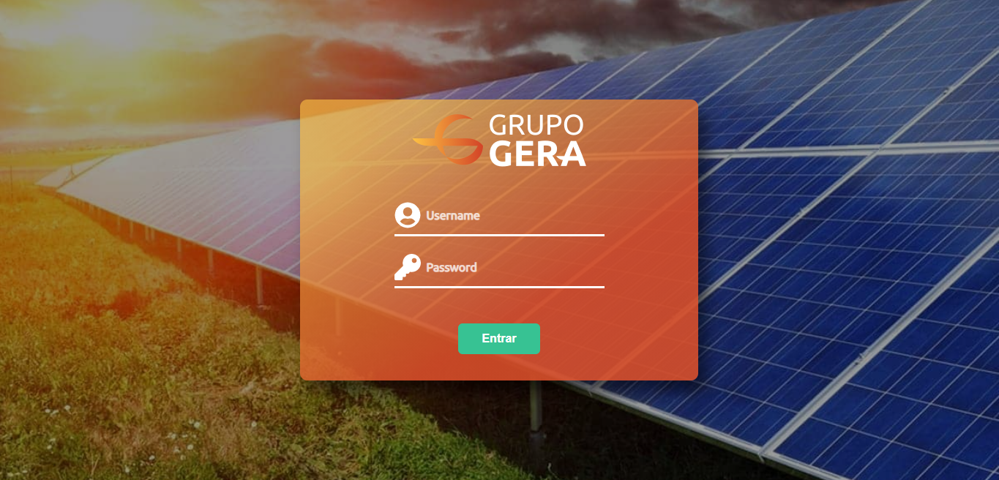
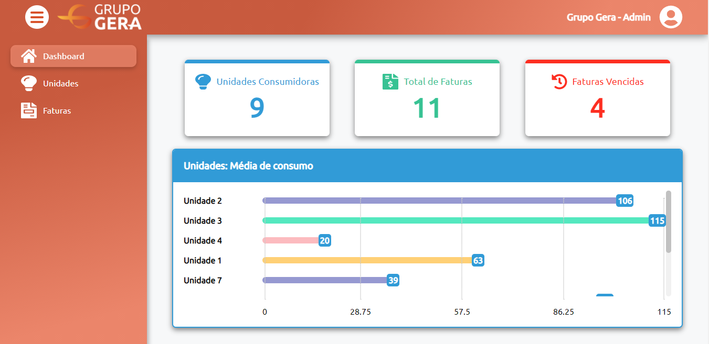
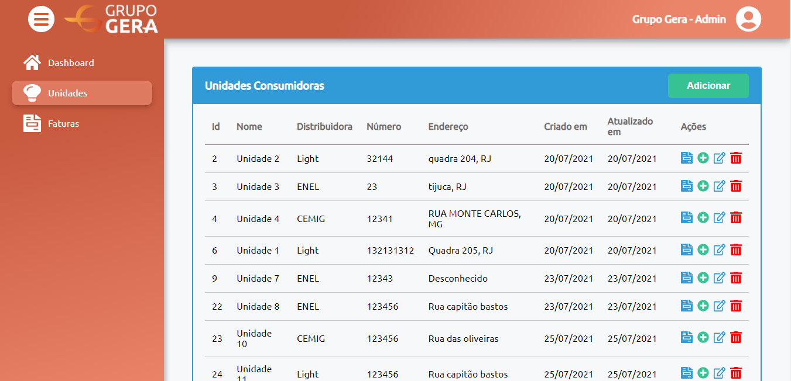
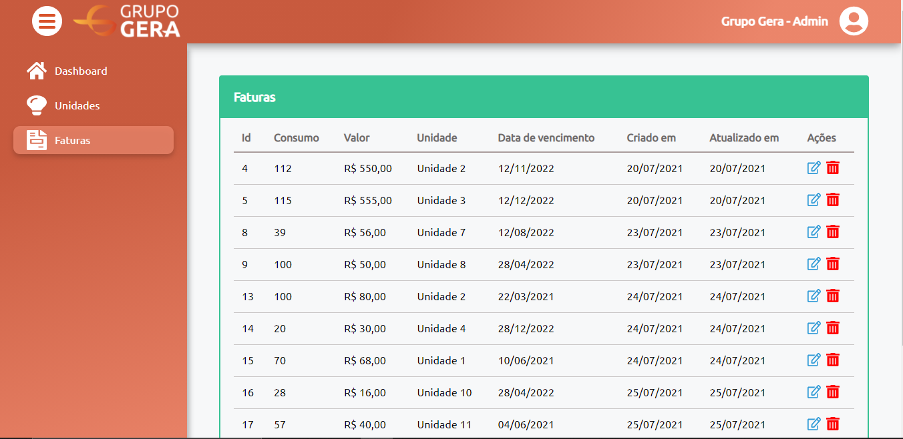
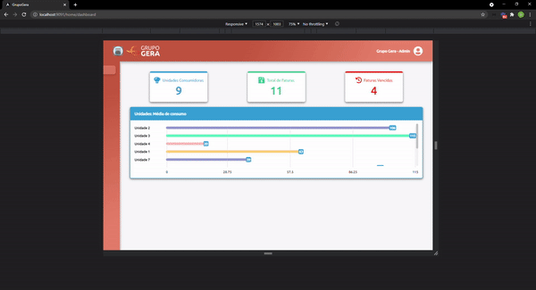

<p align="center">
  
</p>

<h1 align="center">Grupo Gera</h1>

## Objetivo

Desenvolver um dashboard que possibilitará a visualização, criação, modificação e remoção de unidades consumidoras dos clientes, além das tarifas que elas possuem.<br />
<strong>Prazo: 1 semana<strong>

## O que foi desenvolvido? 🚀

<div align="center">
  <br>
    
  <br>
    Tela inicial
</div>

<div align="center">
  <br>
    
  <br>
    Dashboard
</div>

<div align="center">
  <br>
    
  <br>
    Unidades Consumidoras
</div>

<div align="center">
  <br>
    
  <br>
    Faturas
</div>

## Responsividade ⚖



## Tecnologias usadas 📚

- HTML5
- SCSS
- TypeScript
- Angular 10
- RXJS

## Desenvolvimento 🎬

Ciclo de desenvolvimento utilizado:

- Prototipação (Figma)
- Script de iniciação (ng serve --port 9091 --open)
- Configuração do SCSS
- Estilos SCSS padrões
- Criação de módulos principais (ng g m modules/home)
- Configuração de rotas (app-routing.module.ts) e index.ts
- Criação de componentes dos módulos (ng g c modules/auth/login)
- Estruturação do html e css da página (BEM)
- Organização dos assets
- Configuração de environment
- Criação dos serviços e models
- TsConfig
- Componetização (Separar responsabilidades)
- Testes unitários
- Refatoração e melhorias

Clonando o repositório:

```
git clone https://github.com/DanielSoaresRocha/GrupoGera.git
```

Navegando até a pasta do repositório:

```
cd grupo-gera
```

Baixando as dependências

<small>Execute:</small> `npm i` ou `yarn`

Rodando o projeto

<small>O navegador será aberto automaticamente com o servidor iniciado na porta 9091</small>
<br />
<small>Execute:</small> `npm run start` ou `yarn start`

## License 📝

This project is licensed under the [MIT License](https://opensource.org/licenses/MIT) - see the [LICENSE](LICENSE) file for details.

## Autor

<table>
  <tr>
    <td align="center"><a href="https://github.com/DanielSoaresRocha"><br /><sub><b>Daniel Soares</b></sub></a><br /><a href="https://github.com/DanielSoaresRocha/ESIG-challenge/commits?author=DanielSoaresRocha" title="Code">💻</a></td>
  <tr>
</table>
